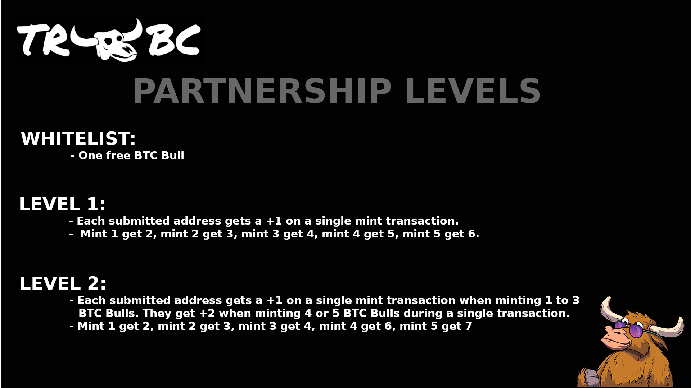

# PARTNERSHIPS

<figure><figcaption></figcaption></figure>

As a project, we want to partner with existing projects with reputable teams in the web3 space to help grow our community. In doing so, we will offer different levels of partnerships. All partnerships that want to take part in this project will need to send addresses to us so we can upload all those addresses into the correct mapping on the smart contract to handle this logic.&#x20;

