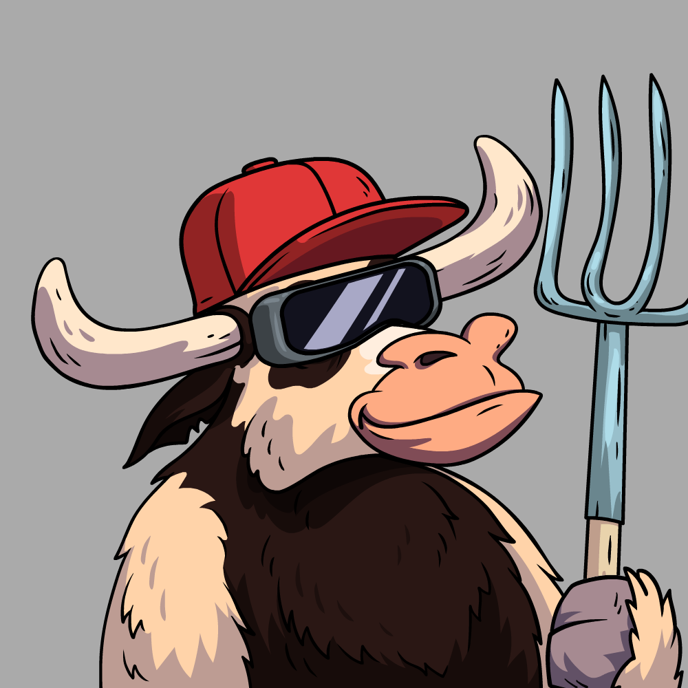
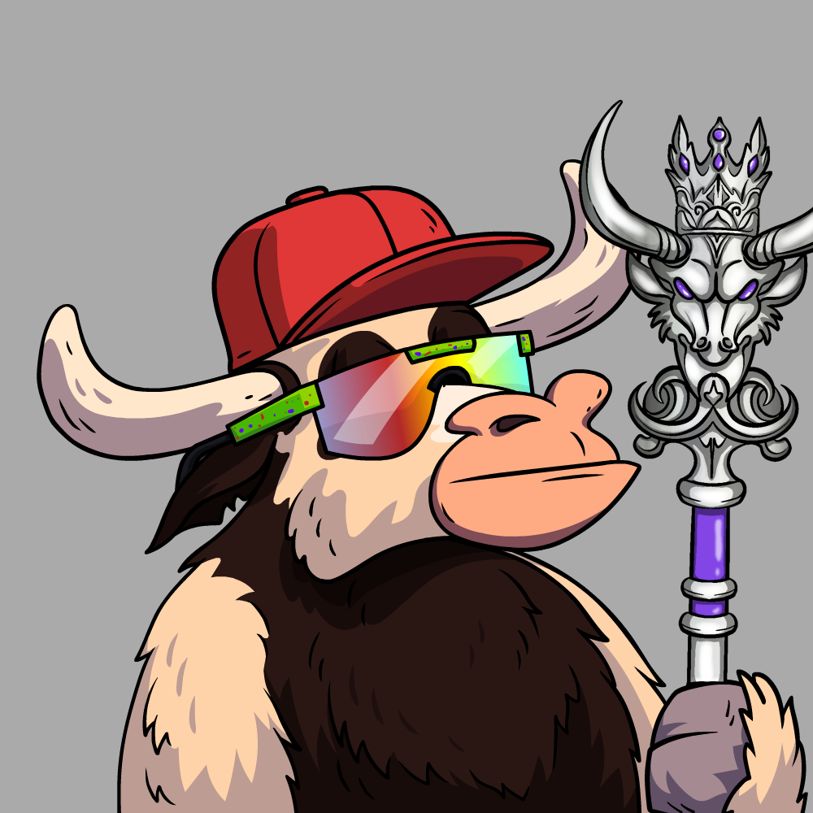
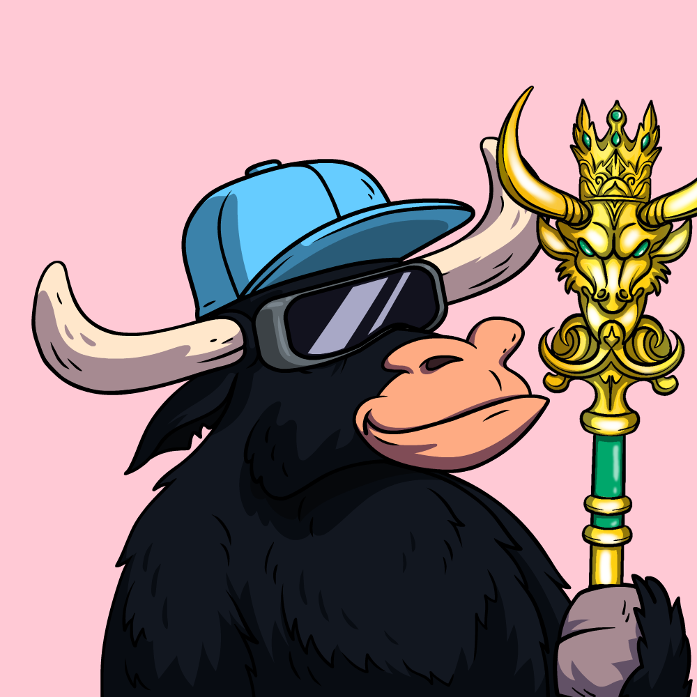

# COLLECTION

## **A collection of 5,000 TR Bull NFTs on the Polygon Blockchain.**

* The TR Bulls are the OG's on the property.&#x20;
* Access to the TR Bulls profits from investments using our point system.
* Weighted voting also uses our point system to guide the project to success.&#x20;

## There are 2 groups of TR Bulls; Normal TR Bulls and Alpha TR Bulls.

## **Normal TR Bulls:**

* Any Bull without a Staff, with or without a Frog or Turtle.
* Minting Bounty Awards are for the 'Normal' Bulls. Minting Bounty Awards go to each Normal TR Bull with a Turtle or a Frog.
  * When minting TR Bulls with a Frog, the owner gets a $1000 airdrop.&#x20;
  * When minting TR Bulls with a Turtle, the owner gets a $750 airdrop.&#x20;
* Normal TR Bulls include any TR Bull with an index number from 1 - 4900.&#x20;
* Frogs and Turtles are randomly placed, and some are given away as awards for minting. See [minting-bounty.md](../../tr-bulls/whitepaper/minting/minting-bounty.md "mention")for more details.&#x20;

****

## **Alpha TR Bulls:**

* **Any Bull with a Bronze, Silver, or Gold Staff.**&#x20;
* Use a separate minting process that is not included in presale1,2,3 and public sale of the normal TR Bulls.&#x20;
* Rare and the increase point earnings.&#x20;
* Bronze Alpha TR Bulls are from index 4901 - 4960
* Silver Alpha TR Bulls are from index 4961 - 4990
* Gold Alpha TR bulls are from index 4991 - 5000

### .png>)

## Distribution of Types:&#x20;

<table data-view="cards"><thead><tr><th align="center"></th><th align="center"></th></tr></thead><tbody><tr><td align="center">Regular TR Bulls </td><td align="center">4881 (97.68%)</td></tr><tr><td align="center">Regular TR Bulls with Turtle</td><td align="center">11 (0.22%)</td></tr><tr><td align="center">Regular TR Bulls with Frog</td><td align="center">8 (0.16%)</td></tr><tr><td align="center">Bronze Alpha TR Bulls</td><td align="center">60 (1.2%)</td></tr><tr><td align="center">Silver Alpha TR Bulls</td><td align="center">30 (0.6%)</td></tr><tr><td align="center">Gold Alpha TR Bulls</td><td align="center">10 (0.2%)</td></tr></tbody></table>

