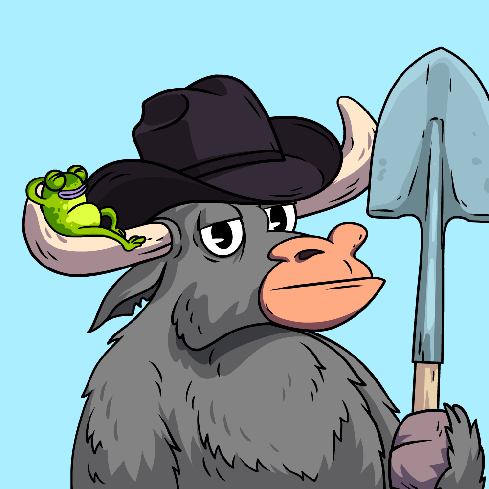

# COLLECTION

## **A collection of 5,000 TR Bull NFTs on the Polygon Blockchain.**

* The TR Bulls are the OG's on the property.&#x20;
* Access to the TR Bulls profits from investments.
* Weighted voting to guide the project to success moving forward.&#x20;

### There are 2 groups of TR Bulls; Normal TR Bulls and Alpha TR Bulls.

* **Normal TR Bulls:**
  * Any Bull without a Staff, with or without a Frog or Turtle.&#x20;
  * #### Minting Bounty Awards are for the TR Bulls with Turtle and Frogs.&#x20;
    * TR Bulls with a Frog will each receive a $1000 airdrop with an equal weight of Silver TR Bull.&#x20;
    * TR Bulls with a Turtle will each receive a $750 airdrop with an equal weight of Bronze TR Bull.

****

* **Alpha TR Bulls:**
  * Any Bull with a Bronze, Silver, or Gold Staff.&#x20;

###  (1).png>).png>)

## Distribution of Types:&#x20;

<table data-view="cards"><thead><tr><th align="center"></th><th align="center"></th></tr></thead><tbody><tr><td align="center">Regular TR Bulls </td><td align="center">4881</td></tr><tr><td align="center">TR Bulls with Turtle</td><td align="center">11</td></tr><tr><td align="center">TR Bulls with Frog</td><td align="center">8</td></tr><tr><td align="center">Bronze TR Bulls</td><td align="center">60</td></tr><tr><td align="center">Silver TR Bulls</td><td align="center">30</td></tr><tr><td align="center">Gold TR Bulls</td><td align="center">10</td></tr></tbody></table>

