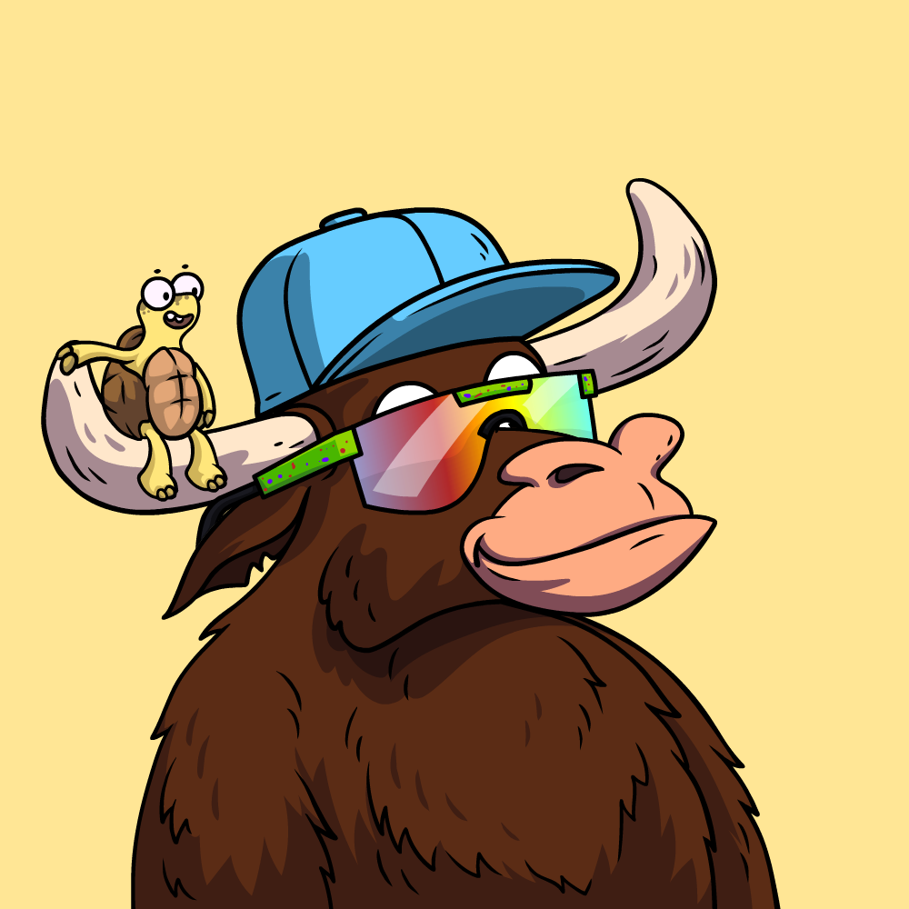

# COLLECTION

## **A collection of 5,000 TR Bull NFTs on the Polygon Blockchain.**

* The TR Bulls are the OG's on the property.&#x20;
* Access to the TR Bulls profits from investments using our native point system, aka 'Bullion.'
* Weighted voting also uses Bullion to guide the project to success.&#x20;

The TR Bulls are categorized into two groups: Normal TR Bulls and Alpha TR Bulls. Normal TR Bulls refer to those without a staff, whether they have a frog or turtle or not. As for the minting process, Normal Bulls are eligible for exclusive Minting Bounty Awards, with each Normal TR Bull having a turtle or frog qualifying for the award.

The Normal TR Bulls comprise the majority of Bulls in the collection and serve as the essential component for being a member of all our rewards and games.

## **Normal TR Bulls:**

* Any Bull without a Staff, with or without a Frog or Turtle.
* Minting Bounty Awards are for the 'Normal' Bulls. Minting Bounty Awards go to each Normal TR Bull with a Turtle or a Frog.
  * When minting TR Bulls with a Frog, the owner gets a $1000 airdrop.&#x20;
  * When minting TR Bulls with a Turtle, the owner gets a $750 airdrop.&#x20;
* Normal TR Bulls include any TR Bull with an index number from 1 - 4900.&#x20;
* Frogs and Turtles are randomly placed, and some are given away as awards for minting. See [minting-bounty.md](../../tr-bulls/whitepaper/minting/minting-bounty.md "mention")for more details.&#x20;

****

## **Alpha TR Bulls:**

I created this project for multiple reasons and individuals in my life outside of DeFI have expressed interest in participating. In the past, I've been involved in projects where certain key NFTs or project aspects were only available to the founders' friends and family. This exclusivity can be discouraging to the broader community who feel they do not have equal access to these types of assets.

Therefore, the Alpha Bull NFTs were designed for anyone who believes in our vision and wants to be a part of our project at its core level. They are not reserved for any specific individual, and all are welcome to participate in buying them, regardless of whether I know them personally or they are simply a wallet address. The Alpha Bulls are open to anyone who shares our values and wants to contribute to the project's growth.

* **Any Bull with a Bronze, Silver, or Gold Staff.**&#x20;
* Use a separate minting process that is not included in Presale1, 2, 3, and the Public sale of the normal TR Bulls.&#x20;
* Rare and the increase point earnings.&#x20;
* Bronze Alpha TR Bulls are from index 4901 - 4960
* Silver Alpha TR Bulls are from index 4961 - 4990
* Gold Alpha TR bulls are from index 4991 - 5000

### .png>)

## Distribution of Types:&#x20;

<table data-view="cards"><thead><tr><th align="center"></th><th align="center"></th></tr></thead><tbody><tr><td align="center">Regular TR Bulls </td><td align="center"><strong>4881</strong> (97.68%)</td></tr><tr><td align="center">Regular TR Bulls with Turtle</td><td align="center"><strong>11</strong> (0.22%)</td></tr><tr><td align="center">Regular TR Bulls with Frog</td><td align="center"><strong>8</strong> (0.16%)</td></tr><tr><td align="center">Bronze Alpha TR Bulls</td><td align="center"><strong>60</strong> (1.2%)</td></tr><tr><td align="center">Silver Alpha TR Bulls</td><td align="center"><strong>30</strong> (0.6%)</td></tr><tr><td align="center">Gold Alpha TR Bulls</td><td align="center"><strong>10</strong> (0.2%)</td></tr></tbody></table>

