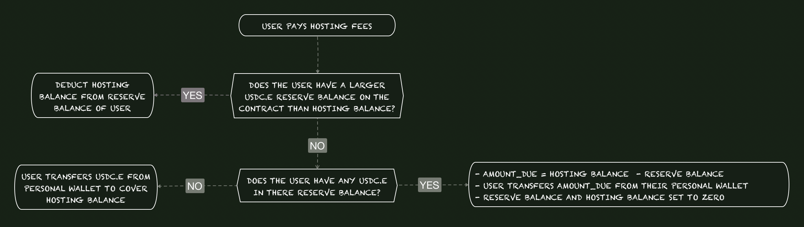

# MINTING

The BTC Bulls will be sold in four different phases. Presale 1, Presale 2, Presale 3, Public Sale. During each phase, minting transactions must mint 1,2,3,5,7 or 9 BTC Bulls.&#x20;

## MINT COST:

Presale 1 Base Price per NFT = $400

* Whitelist Prices:

<figure><figcaption>
Presale 1 whitelist Cost
</figcaption></figure>

Presale 2 Base Price per NFT = $425

* Whitelist Prices:

Presale 3 Base Price per NFT = $450

* Whitelist Prices:

Public Sale Base Price per NFT = $425

* Whitelist Prices:

## COST DISTRIBUTION WHEN BUYING WITH USDC:&#x20;

* 80% of the transaction goes to the BTC MINERS SAFE to purchase miners at the hosting facility.&#x20;
* 11% is sent to the WAR-CHEST, the multi-sig wallet serving as our war chest for the BTC Bulls. This money is kept in reserve if/when unseen costs arise for the project.&#x20;
  * "By failing to prepare, you are preparing to fail" is the motto we stand behind when it comes to our war chest model.
* 5% is held for the Rarity Airdrops for Bulls with Frogs and Turtles.
* 2% goes to the Buddy of the address minting NFTs via the Buddy System.
* 1% goes to MARKETING SAFE multi-sig wallet.

&#x20;

<figure><figcaption>
USDC MINT DISTRIBUTION
</figcaption></figure>

## CREDIT CARD PURCHASING OF BTC Bulls

The smart contract itself can support purchasing with credit cards via paper.xyz

* 81% of the transaction goes to the BTC MINERS SAFE to purchase miners at the hosting facility.&#x20;
* 13% is sent to the War Chest. This money is kept in reserve if/when unseen costs arise for the project. A project failing to prepare is a project preparing to fail.&#x20;
* 6% is held for the Rarity AirDrop Payout.
* 1% goes to Marketing.

_When using a credit card, the buddy address awarding is skipped and will not be counted as the paper.xyz will allow you to mint with a paper wallet and then transfer to your wallet._&#x20;
