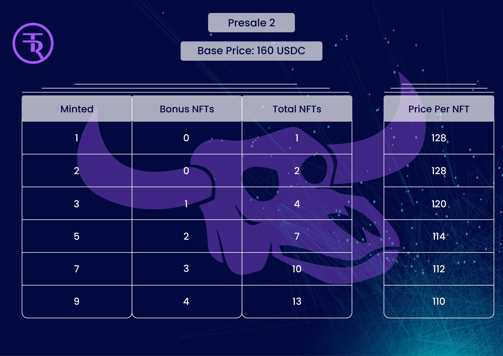

# MINTING

The TR Bulls will be sold in four phases;&#x20;

* Presale 1
* Presale 2
* Presale 3
* Public Sale.&#x20;

During each phase, minting transactions must mint 1,2,3,5,7 or 9 TR Bulls.&#x20;

| Phase       | NFTs Available  |
| ----------- | --------------- |
| Presale 1   | 250             |
| Presale 2   | 400             |
| Presale 3   | 550             |
| Public Sale | 3800            |

## MINT COST:  Phase dependant varying from $150 to $180

<figure><figcaption></figcaption></figure>

<figure><figcaption></figcaption></figure>

<figure><figcaption></figcaption></figure>

<figure><figcaption></figcaption></figure>

## Whitelisted:

* When whitelisted, the user gets discounts when minting for the duration of the minting process. I.e., whitelisted in presale 1 carries over and whitelist eligibility remains in presale 2 and beyond. &#x20;
* To be whitelisted, Trivia events and other Discord and Twitter competitions. &#x20;
* When whitelisted, the bonus is as follows:&#x20;
  * Purchasing 1 or 2 TR Bulls during a single transaction gives you a 20% discount on the base price for the phase.&#x20;
  * Purchasing 3, 5, 7, or 9 TR Bulls in a single transaction automatically sends more TR Bulls to your minting wallet as a Bonus.&#x20;
  *   Purchasing transaction examples during Presale 1 when whitelisted:

      * **Minting 1 TR Bull.**&#x20;
        * The cost is $120 in USDC.&#x20;
        * The user receives 1 TR Bull NFT.
      * **Minting 2 TR Bulls.**
        * The cost is $240 in USDC.
        * &#x20;The user receives 2 TR Bull NFTs.
      * **Minting 3 TR Bulls.**
        * The cost is $450 in USDC.
        * &#x20;The user receives 4 TR Bull NFTs.
      * **Minting 5 TR Bulls.**
        * The cost is $750 in USDC.
        * &#x20;The user receives 7 TR Bull NFTs.
      * **Minting 7 TR Bulls.**
        * The cost is $1050 in USDC.
        * &#x20;The user receives 10 TR Bull NFTs.
      * **Minting 9 TR Bulls.**
        * The cost is $1350 in USDC.
        * &#x20;The user receives 13 TR Bull NFTs.

      &#x20;

## &#x20;USDC DISTRIBUTION WHEN MINTING TR BULLS.BUYING WITH TRT:&#x20;

* 80% of the transaction goes to the BTC MINERS SAFE to purchase miners at the hosting facility.&#x20;
* 11% is sent to the War Chest, the multi-sig wallet serving as our war chest for the BTC Bulls. This money is kept in reserve if/when unseen costs arise for the project.&#x20;
  * "By failing to prepare, you are preparing to fail" is the motto we stand behind when it comes to our war chest model.
* 6% is held for the Rarity Airdrops for Bulls with Frogs and Turtles.
* 2% goes to the Buddy of the address minting NFTs.
* 1% goes to MARKETING.

<figure><figcaption>
USDC MINT DISTRIBUTION
</figcaption></figure>

## COST DISTRIBUTION WHEN BUYING WITH A CREDIT CARD

The smart contract itself can support purchasing with credit cards via paper.xyz

* 80% of the transaction goes to the BTC MINERS SAFE to purchase miners at the hosting facility.&#x20;
* 13% is sent to the War Chest. This money is kept in reserve if/when unseen costs arise for the project. A project failing to prepare is a project preparing to fail.&#x20;
* 6% is held for the Rarity AirDrop Payout.
* 1% goes to Marketing.

_When using a credit card to purchase TR Bulls, the buddy system reward is bypassed and will not be counted as the paper.xyz will allow you to mint with a paper wallet and then transfer to a wallet of your choice._&#x20;

<figure><figcaption>
CREDIT CARD MINT DISTRIBUTION
</figcaption></figure>
