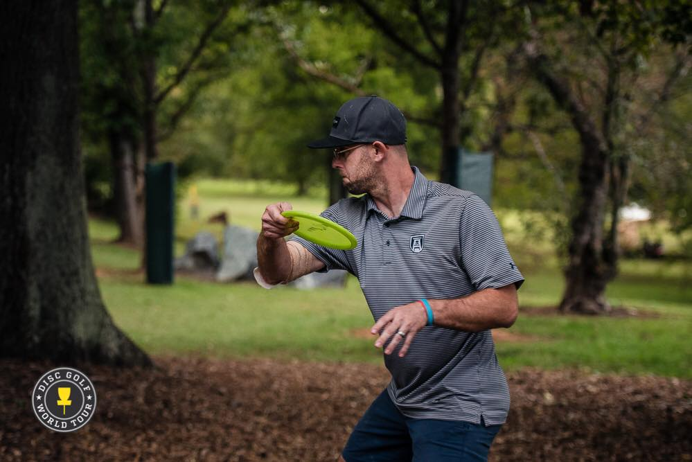

# Masquerading TRT

<figure><figcaption></figcaption></figure>

One of the biggest parts of making TRT, TRUST RESERVOIR TOKEN, was more than just having it be our native token. We have been working to bring this token into niche communities to bring them value and introduce them to the good side of web3 and crypto in general. We will be a force of good to better the name of crypto, bring transparency to it, and build Trust all along the way. By "Masquerading" the TRT token, we will make other tokens like DDGT that appeal to that given community to drive adoption of it.  On the backend of websites built for DDGT, all contract calls will be made to the TRT token contract itself. Thus benefiting holders of the TRT token even if you don't have anything to do with Disc Golf. &#x20;

## Why Disc Golf?

It's important to know where the project's founder comes from, the value of his connection to the game, and this approach to make TRT a key part of Disc Golf moving forward.&#x20;

Disc Golf is a game that's growing more popular year by year. I played and devoted my early adult life to this game as I toured around the world, playing tournament after tournament with one end goal, to be a World Champion!

The value the DDDGT token brings to Disc Golf, and the value I bring as the ambassador of this Token is critical. I know thousands upon thousands of players, hundreds upon hundreds of tournament directors, and key decision-makers in all game phases.

<figure><figcaption></figcaption></figure>

To give you a quick understanding of the value in the game of Disc Golf, Here's an excellent article about a friend of mine, Simon Lizotte, who now joins Paul McBeth and Ricky Wysocki as the multi-million dollar sponsorships deals.&#x20;

* [https://discgolf.ultiworld.com/2023/01/12/inside-the-simon-lizotte-mvp-deal-the-contract-how-it-came-together-and-whats-next/](https://discgolf.ultiworld.com/2023/01/12/inside-the-simon-lizotte-mvp-deal-the-contract-how-it-came-together-and-whats-next/)

As I've stated before, my vision for starting this project was to bridge the gap between web2 and web3. The first place I want to start in this quest is the world of Disc Golf. The overall goal of DDGT  is to support Disc Golf tournaments worldwide in real life and the digital side of Disc Golf within the ever-growing world of Esports.&#x20;

