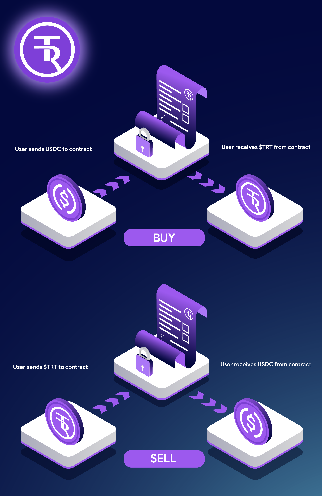

# Token Mechanics - Mint & Redeem

## **BUY (MINT)**

* $TRT can only be minted through the dApp with USDC.
* Initially, the only way to acquire $TRT will be through minting on the dApp. Eventually, liquidity will be added to the open market to purchase $TRT through DEX’s and other protocols.&#x20;
*   All buys charge a 2% fee.

## **SELL**&#x20;

* Selling $TRT is an OTC (Over the Counter) direct exchange between the user and the protocol with no price impact beyond the selling fee.
* $TRT is sold and exchanged for USDC.  &#x20;
* All sells charge a 2% fee.&#x20;

<figure><figcaption></figcaption></figure>

