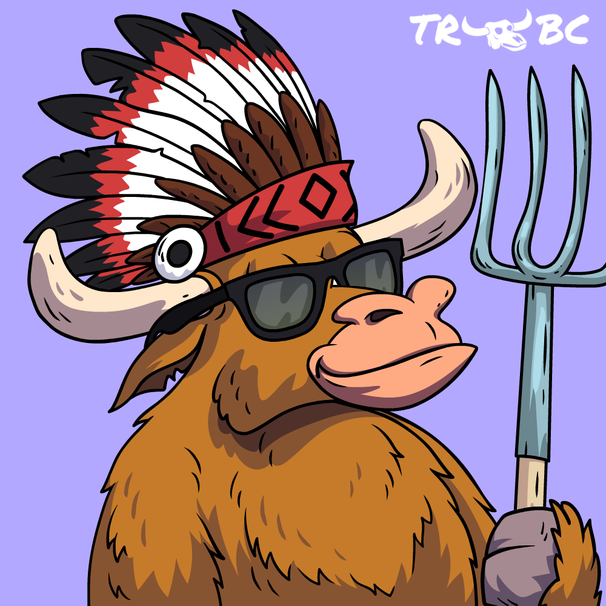
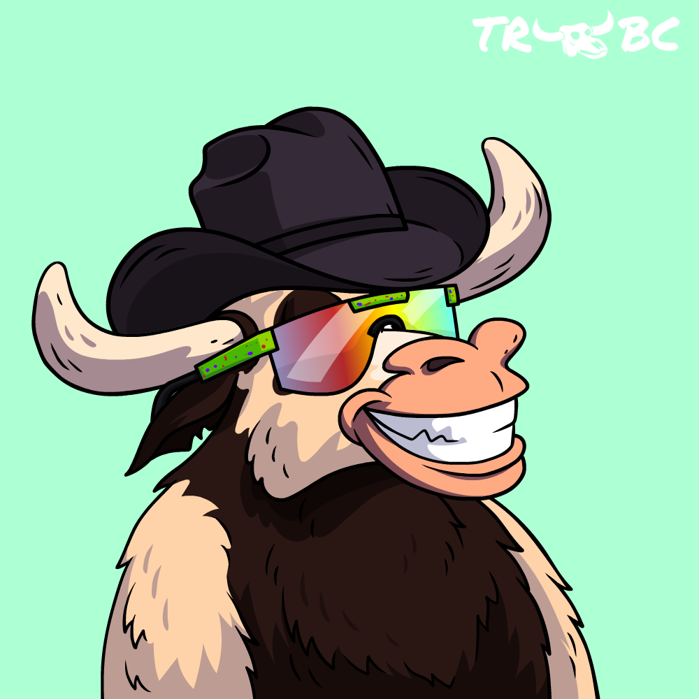

# COLLECTION

## BTC Bulls

************

### **A collection of 10,000 BTC Bull NFTs on the Polygon Blockchain.**&#x20;

* No whitelist; You are in because you want to be, not who you know
* Access to the BTC Bulls mining cluster's rewards\*
* Initial Minting Giveaway opportunity upon minting a BTC Bull and long-term royalty rewards program opportunities.&#x20;
* &#x20;20 BTC Bulls are considered 'enlightened' and thus the rarest!&#x20;
  * Once revealed, 'Enlightened' BTC Bulls are maintenance fee exempt moving forward\*\* &#x20;
  *   The location of 'Enlightened' BTC Bulls is unknown to all, including the team. We only know 20 exist within the collection.

      

\*Access as long as the project can successfully mine BTC and the individual retains ownership of the BTC Bull.  &#x20;

## BTC Bears

.png>) (5) (2).png>)

### **A collection of 10,000 BTC Bear NFTs on the Polygon Blockchain.**&#x20;

* No whitelist; You are in because you want to be, not who you know
* Access to the BTC Bears mining cluster's rewards\*
* Initial Minting Giveaway opportunity upon minting a BTC Bears and long-term royalty rewards program opportunities.&#x20;
*   &#x20;20 BTC Bears are considered 'enlightened' and thus the rarest!&#x20;

    .png>)
* Once revealed, 'Enlightened' BTC Bears are maintenance fee exempt moving forward\*\* &#x20;
* The location of 'Enlightened' BTC Bears is unknown to all, including the team. We only know 20 exist within the collection.

\*Access as long as the project can successfully mine BTC and the individual retains ownership of the BTC Bear.  &#x20;
