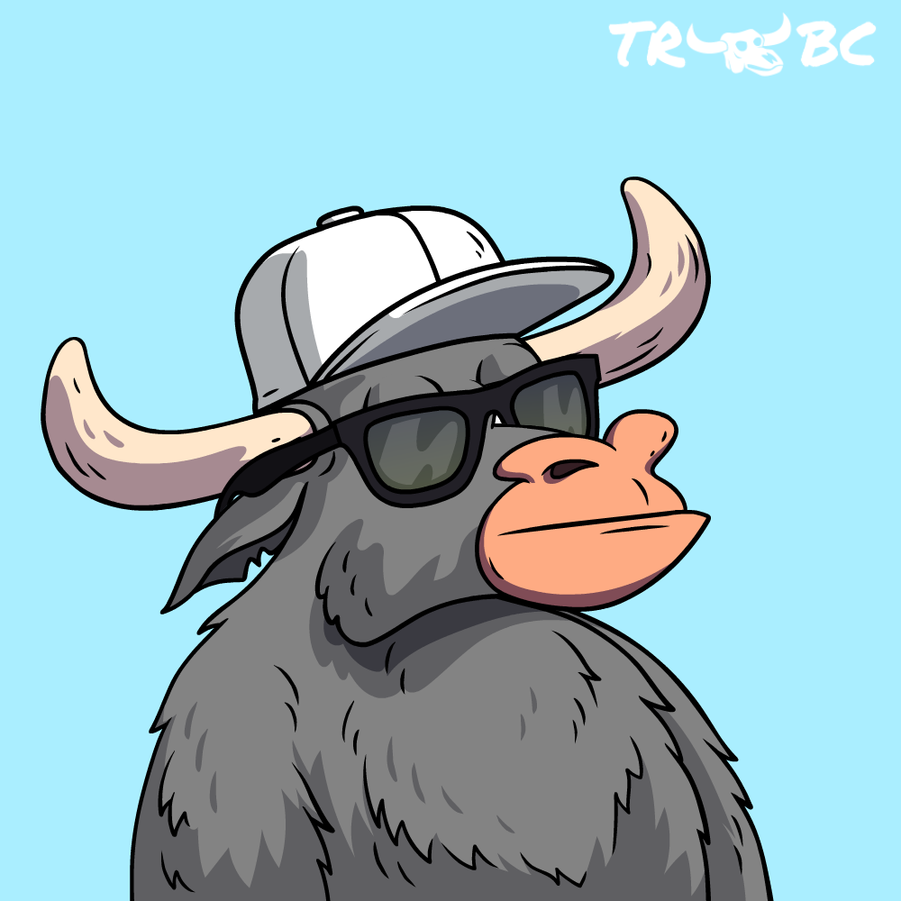

# OPERATIONS 101

## 10,000 FT VIEW OF 10,000 BTC Bulls & BTC Bears

The BTC Bulls and BTC Bears are separate communities within The Ranch, built around Bitcoin Mining. This project is a club and a MAAS (mining-as-a-service) hybrid model. The heart of the ecosystem is buying BTC Bulls and/or BTC Bears, a way of buying into a fractionalized BTC mining cluster and sharing mining rewards.&#x20;

A project built with:

* Real utility&#x20;
* Real Yield
* Real Rewards

There is strength in numbers, and the BTC Bulls and the BTC Bears, while separate, will put this on full display as a community.&#x20;

## WHY START THE PROJECT?

This is a loaded question and one I have to give several answers to:

**Reason 1:**

The bear market is doing what it does best; purging scammers, rug pulls, and deceitful players.&#x20;

**Reason 2:**

The last year has been chaos and financial obliteration in the crypto space. The goal from the beginning stages of this project was to launch when we were close and/or at the bottom of the Bear Market concerning BTC. Likely, we haven't reached the bottom of the Bear market yet, as the BTC hash rate hasn't collapsed yet. BTC hash rate collapsing around Bitcoins bottom makes sense from a cause-and-effect point of view. Two key events are happening or have happened that are affecting this:

* Lots of BTC mining companies are struggling, and a few of the larger publicly-traded Mining Companies have or are in the process of filing for bankruptcy. (i.e., compute-north & core-scientific).&#x20;
* The profitability of BTC mining is causing the small players to close up shop as profits are dwindling.

**Reason 3:**&#x20;

The price of BTC could likely fall further in the early months of next year when consumers realize they took on too much debt over the holiday season and start selling their BTC and other tokens/coins to make up for it.&#x20;

**Reason 4:**

The key to the success and profitability of this project is all about the timing of the start of the project. The price of the BTC miners and the hosting/electricity fees are the key factors. In December of 2021, an S19j Pro BTC Miner cost roughly $13K. Today, due to market conditions and the onset of the bear market, that same S19j Pro BTC MIner can be purchased for nearly $3K.&#x20;

This is the prime reason the project is kicking off now and relies heavily on the bear market. We have purchased BTC miners leading up to the start of this project to vet out the sellers and hosting facilities. Anyone can buy a single miner themselves and host it at their house. For the sake of an Antminer S19j Pro 100 TH/s, the challenge for said buyer is that the Miner requires a 240v outlet and a suitable place to host it. As an owner of an Antminer s19a Pro 110 TH/s sitting in my garage now, I can tell you without a doubt that these sound like a freight train, produce way more heat than you want to deal with, and cost more in electricity than you would pay at these hosting facilities. I have to pay $0.12 (which isn't that bad in terms of the national price of electricity in the US) kWh at my home. This doesn't compare to what 'enterprise' clients at mining facilities get; buying in bulk allows the 'big boys' to start with electricity prices at or below $.070 kWh. &#x20;

The way the hosting works at large hosting facilities is that they will provide a monthly invoice for each miner they host that is calculated like this:&#x20;

3,105 watts x 24hr / 1000 = 74.52kWh                (Each S19 runs at about 3100-3200 watts)

74.52 kWh x 0.070$/kwh = $5.22                        (Cost of a single S19/day in electricity at low rate)

$5.22 x 30 days = $156.60/month                      (Cost of electricity per month per miner)

Knowing that the energy costs will be a critical factor in the project's success, we know that partnering with the right business will make a huge difference.&#x20;

****

## PARTNERSHIPS

<figure><figcaption></figcaption></figure>

We are excited to partner with Compass Mining as we launch the project.&#x20;

Anyone can buy and host mining equipment at a mining facility or their own house if they are set up for it. If they chose to do that, they would be seen as a 'residential' buyer and be subject to fewer benefits. Residential buyers buy a miner or two but do not buy in bulk. Reputable mining companies want to sell to this class of buyers but don't cater to them as they do to their bigger clients.&#x20;

The "Strength in numbers" aspect of the project will be the foundational reason for our success. Collectively we move out of the 'residential' space and are seen as an 'enterprise' client. This is hugely important for the project for two key reasons.&#x20;

* Cheaper prices for miners&#x20;
* Cheaper prices for electricity&#x20;

First and foremost, we will see our 'Enterprise' customer relationship bear fruit immediately with the initial cost of miners and hosting rates. Secondly, Compass does a great job on the back end handling all the logistics, security, maintenance, system uptime SLAs (service level agreements), and automation.&#x20;

Another reason partnering with Compass Mining is a great idea, they provide us flexibility when we move into more bullish times. Any miners we buy now for greatly reduced prices can later be sold on their platform to other customers as 'turn key' solutions for a 2-4x gain if we want to sell them and move into newer equipment.&#x20;

Check them out: [https://compassmining.io/](https://compassmining.io/)

##  MONTHLY BTC MINING REWARDS

All BTC mining efforts will be processed monthly between the 1st and 5th of the month for both communities.&#x20;

**1/3** of all rewards received from the mining facility will be reinvested back into the mining cluster to purchase more BTC miners.&#x20;

**2/3** of the monthly mining rewards will be converted to WBTC and deposited into the respective smart contract of the BTC Bulls or the BTC Bears, depending on which mining cluster the rewards are coming from. When deposited into the smart contract, 10% goes back to The Ranch Core Team for continued project growth, security measures, and marketing. The remaining 90% is then dispersed to the owners of the BTC Bulls or BTC Bear NFTs in pro-rata format. Using this approach, each NFT is awarded the same amount. An address owning 5 NFTs would get 5x more WBTC rewards than a wallet address owning a single NFT.

The communities do not share resources and are completely segmented from each other. A BTC Bear doesn't benefit from the BTC Bull's mining rewards and the BTC Bull doesn't benefit from what the BTC Bears are doing.&#x20;

Using the **1/3** and **2/3** approaches discussed above is going to be the way the project starts. This approach is an ideal ratio to help grow the number of miners working for us. However, this is not written in stone by design. When we move back into a Bull Market, and the price of BTC nears and surpasses its all-time high prices, it doesn't make sense for the project to keep pulling **1/3** back to reinvest into miners. We will open this to a vote within each community on the best way to approach this as it nears.

As of now, we are planning to shift to a 90% - 100% reward structure when the price of BTC surpasses $60K. This will be put to the vote within each community when the time comes to solidify the exact percentage of distribution. The intent will be to let NFT owners capitalize on the price action of BTC when the time comes.&#x20;

<figure><figcaption>
FIG 0
</figcaption></figure>

## TOTAL SUPPLY AND MINT COST:

The BTC Bulls Community and The BTC Bears Community are NFT collections built on the Polygon Blockchain, with 10,000 of each collection released in 10 different tiers. Each tier must be bought out completely before the next tier opens. USDC.e is the token used for purchasing in all tiers.&#x20;

<figure><figcaption>
FIG 1
</figcaption></figure>

## TOKENS/COINS THAT WILL BE USED&#x20;

The Ranch BTC Bulls will not revolve around its native token by design. The primary tokens this project will use include the following:

* BTC (BITCOIN)
  * BTC is used as the BTC mining reward token that is received for our mining efforts.&#x20;
* WBTC (WRAPPED BITCOIN)
  * WBTC standardizes BITCOIN to the ERC20 format. This allows us to convert BTC to WBTC,  backed 1:1, and pay out thousands of NFTs within the project.&#x20;
* USDC.e&#x20;
  * Used to mint the NFTs and the reward token used in our minting reward system, mint raffle drawings, and royalty raffle drawings.&#x20;
* MATIC &#x20;
  * This is the native token of Polygon, and each user must have it to use for gas when interacting with the smart contracts.&#x20;

##  **THE BUDDY SYSTEM**

The Buddy System is an onboarding system for new participants in The Ranch Ecosystem. Participation is completely voluntary. Unlike other multi-level marketing and scam-type referral systems, which consist of pyramid structures, tiered referral trees, etc. There is only 1 level of affiliate rewards within The Ranch Ecosystem. Rewards are issued whenever the referred individual mints new NFTs, during the monthly rewarding of WBTC to NFT holders, and during any raffle win. A referred individual to the project only counts within a particular community. For example, if you refer someone to the BTC Bears community and they are also in the BTC Bulls community, you would only get rewards from transactions and events happening on the BTC Bears contract.

* 2% of the minting transaction cost.
* 2% of monthly WBTC reward payouts.
* 2% of the Royalty Raffle winning amount.&#x20;

Within both communities, a Buddy must be in an 'active' state to receive the benefit. Active means the Buddy of the referred person owns a Bull or Bear at the time of the event.&#x20;

* Do I have to have a Buddy? No
* Does not having a Buddy hurt me? No, anyone with a Buddy or without a Buddy will have 2% deducted during the rewarding transactions. If the Buddy is in an active state, it goes to the Buddy of the referred person; if not, it goes to The Ranch Core Team.
* Can I switch my Buddy multiple times? No, once a Buddy is selected, it is final. &#x20;

## HOW LONG DOES EACH MINER LAST, AND WHAT IS DONE WHEN THEY FAIL?

We are projecting each miner to be operational for 60 months. Some will last longer, and others will fail before that time. All miners that can be repaired will be. If the miners are in bad enough condition, we will work with Compass Mining to get what we can for it, and then all those funds will be dispersed, as seen in FIG 0.&#x20;

## BTC Bulls vs. BTC Bears

## 

The BTC Bulls and the BTC Bears are different communities separated by different smart contracts and different wallets. There is only one key difference between them within The Ranch ecosystem; where they reside and their obligations to the property. To be a Bull or Bear depends on your mathematical stance on their actions.&#x20;

&#x20;

