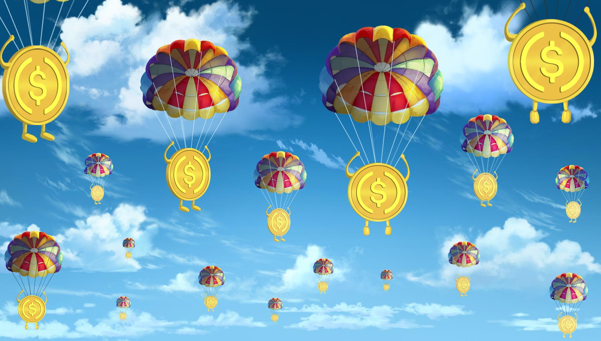

# Payout/Reward 101

**The payout structure**:&#x20;

50% gets rolled back into successful projects and/or to newer projects, 40% gets paid back via our Centennial AirDrop, and 10% gets rolled back to the Core Team for project expansion and overhead. In the example below, this is how a yield of $100K from our collective projects would be split.

.png>)

#### Centennial AirDrop is a giveaway that sends USDC funds to 100 random bulls every week.&#x20;

This approach has two key mechanics behind it.&#x20;

* First and foremost, sending USDC back to all the NFT owners is what we want because we want all the bulls to be to feel like this is an autopilot project. Meaning, this isn't a project where you need to check every week if you won. We could have sent tokens from the projects we are investing into but with the volatility of those coins/tokens, it would be sad if a Bull NFT owner didn't realize they won on a given week and the price of their reward token dropped by 50% before realizing. With USDC being sent back, take this project as a truly idle project and take comfort in knowing that USDC today is the same as USDC next week/month.
* Sending funds to 100 bulls is our key idea. In other projects, they may pick 5-10 winners from their 10,000+ NFTs and payout a bigger reward to their winner. While true, that also increases the likelihood that an NFT owner from other projects will never win anything. Taking the 100 Bull approach, we are exponentially increasing the likelihood that each NFT wins. Coupling this with the fact that we will ONLY have 4999 NFTs eligible for this is another key. Seriously, there isn't a second NFT mint that's going to diminish your odds for winning as you see in other projects. Winning in this type of project is very important as this is the key to making you feel like family in our ecosystem.
