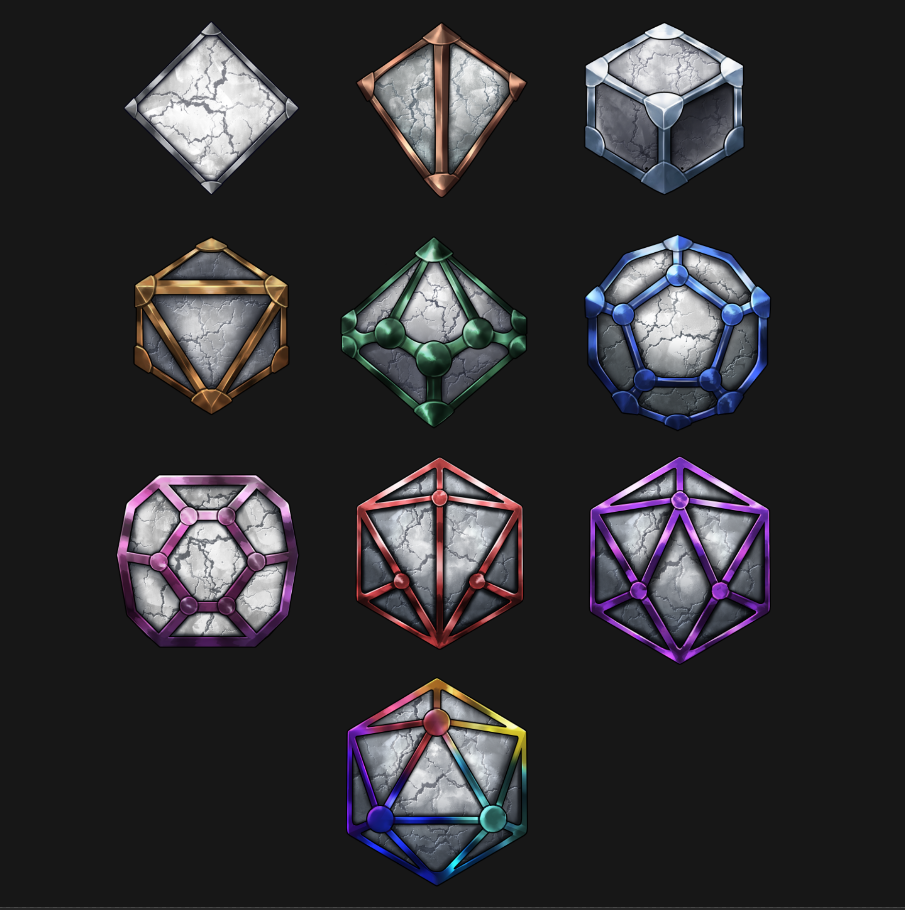

# DEATH BATTLES

Welcome to the new level of risk and reward in the TR Bull ecosystem - the "Death Battles." This is not for the faint of heart, as participants are putting their monthly Bullion Token rewards and even their NFTs on the line. In these battles, players can either compete in the Bull Battles, where they wager their monthly Bullion Token rewards for a chance to earn more, or they can enter a "Death Battle" where they risk losing their NFT for a chance to absorb 75% of the loser's accrual bullion tokens per month and earn a Battle Stone to display the number of Bulls defeated.

These battles are entirely OPTIONAL, but for those who are willing to take the risk, the potential rewards can be significant. The metadata files and NFT images are updated to reflect the new Bullion Tokens earned per month and the number of Bulls defeated. So enter the arena, put your skills and luck to the test, and see if you have what it takes to emerge victorious in the "Death Battles."

<figure><figcaption></figcaption></figure>

The exclusive Battle Stones can only be obtained by participating in a "Death Match". Upon winning a match, a Battle Stone is awarded to the specific NFT, showcasing your accomplishment and increasing your Bull's pride as the owner.

