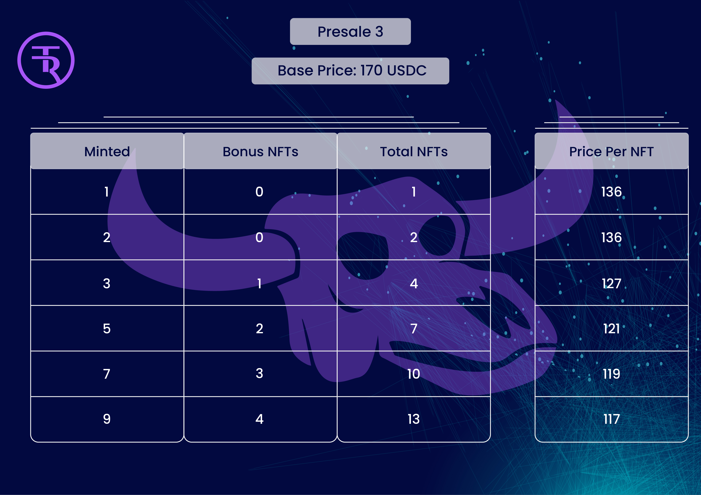
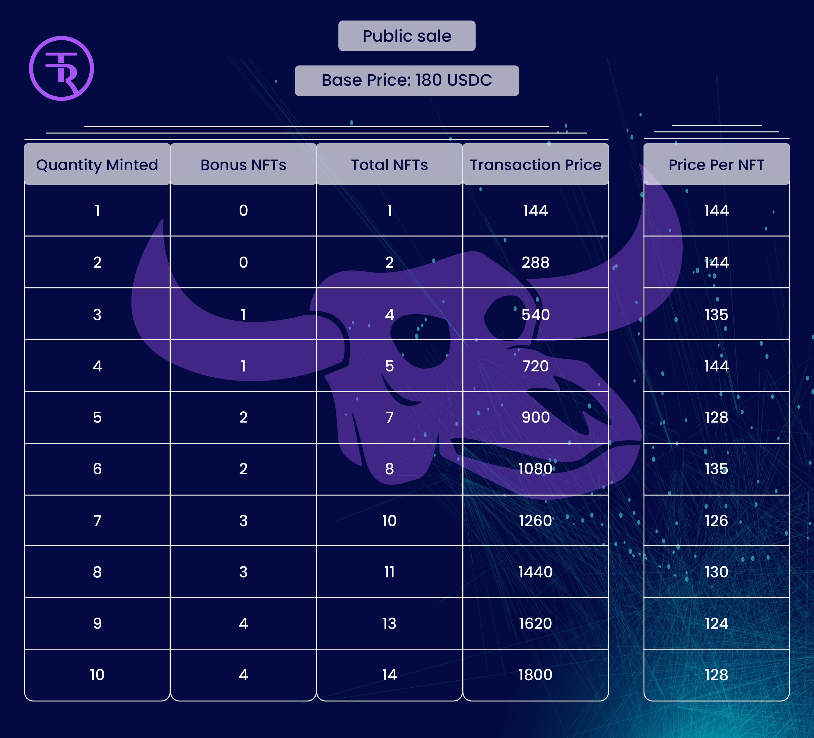

# COST

## Normal TR Bulls:

<figure><figcaption></figcaption></figure>

<figure><figcaption></figcaption></figure>

<figure><figcaption></figcaption></figure>

<figure><figcaption></figcaption></figure>

## Whitelist Explanation::

* When whitelisted, the user gets discounts when minting for the duration of the minting process. I.e., whitelisted in presale 1 carries over, and whitelist eligibility remains in presale 2 and beyond. &#x20;
* To be whitelisted, Trivia events and other Discord and Twitter competitions. &#x20;
* When whitelisted, the bonus is as follows:&#x20;
  * Purchasing 1 or 2 TR Bulls during a single transaction gives you a 20% discount on the base price for the phase.&#x20;
  * Purchasing 3, 5, 7, or 9 TR Bulls in a single transaction automatically sends more TR Bulls to your minting wallet as a Bonus.&#x20;
  * Purchasing transaction examples during Presale 1 when whitelisted:
    * **Minting 1 TR Bull.**&#x20;
      * The cost is $120 in USDC.&#x20;
      * The user receives 1 TR Bull NFT.
    * **Minting 2 TR Bulls.**
      * The cost is $240 in USDC.
      * &#x20;The user receives 2 TR Bull NFTs.
    * **Minting 3 TR Bulls.**
      * The cost is $450 in USDC.
      * &#x20;The user receives 4 TR Bull NFTs.
    * **Minting 5 TR Bulls.**
      * The cost is $750 in USDC.
      * &#x20;The user receives 7 TR Bull NFTs.
    * **Minting 7 TR Bulls.**
      * The cost is $1050 in USDC.
      * &#x20;The user receives 10 TR Bull NFTs.
    * **Minting 9 TR Bulls.**
      * The cost is $1350 in USDC.
      * &#x20;The user receives 13 TR Bull NFTs.

