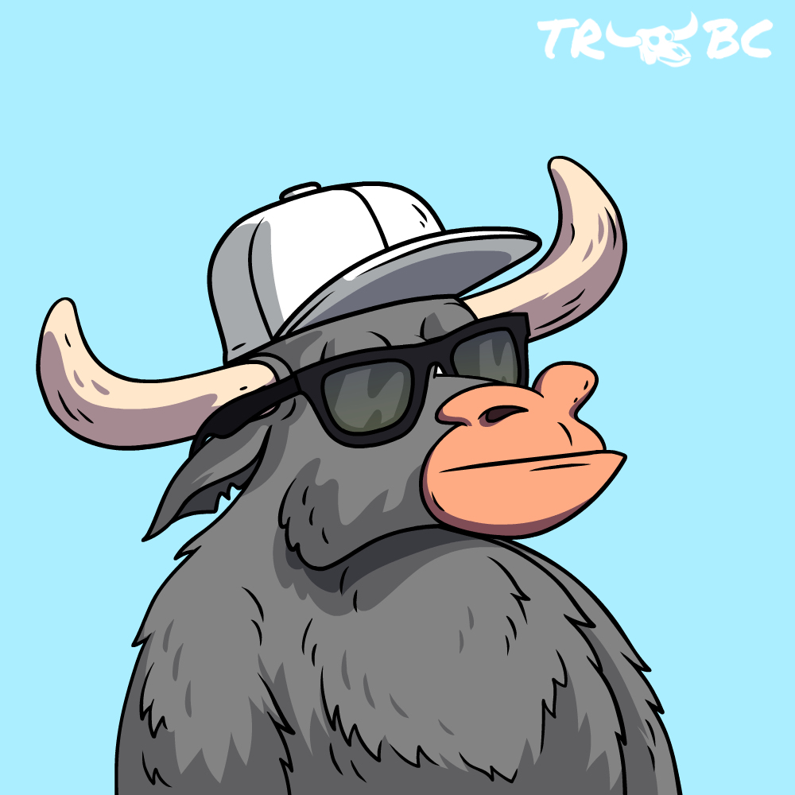

# OPERATIONS 101

## 10,000 FT VIEW OF 10,000 BTC Bulls & BTC Bears

The BTC Bulls and BTC Bears are separate communities within The Ranch, built around Bitcoin Mining. This project combines a MAAS (mining-as-a-service) and a club. The heart of the ecosystem is buying BTC Bulls and/or BTC Bears, a way of buying into a fractionalized BTC mining cluster and sharing mining rewards.  There is strength in numbers, and the BTC Bulls and the BTC Bears, while separate, will put this on full display as a community.&#x20;

## BITCOIN MINING

<figure><figcaption></figcaption></figure>

One person can mine Bitcoin alone, but it doesn't stack up against what we can do as a community.&#x20;

Anyone can buy and host mining equipment at a mining facility or their own house if they are set up for it. If they chose to do that, they would be seen as a 'residential' buyer and be subject to fewer benefits. Residential buyers buy a miner or two but do not buy in bulk. Reputable mining companies want to sell to this class of buyers but don't cater to them as they do to their bigger clients.&#x20;

The "Strength in numbers" aspect of the project will be the foundational reason for our success. Collectively we move out of the 'Residential' space and are seen as an 'Enterprise' client. This is hugely important for the project for two key reasons.&#x20;

* Cheaper prices for miners&#x20;
* Cheaper prices for electricity&#x20;

We are excited to partner with Compass Mining to launch the project as they'll be the best fit to make us as profitable as we can be for multiple reasons.  First and foremost, we will see our 'Enterprise' customer relationship bear fruit immediately with the initial cost of miners and hosting rates. Secondly, Compass does a great job on the back end handling all the logistics, security, maintenance, system uptime SLAs (service level agreements), and automation.&#x20;

Another reason partnering with Compass Mining is a great idea, they provide us flexibility when we move in more bullish times. Any miners we buy now for greatly reduced prices can later be sold on their platform to other customers as 'turn key' solutions for a 2-4x gain if we want to sell them and move into newer equipment.&#x20;

Check them out: [https://compassmining.io/](https://compassmining.io/)

##  MONTHLY BTC MINING REWARDS

All BTC mining efforts will be processed monthly between the 1st and 5th of the month for both communities.&#x20;

**1/3** of all rewards received from the mining facility will be reinvested back into the mining cluster to purchase more BTC miners.&#x20;

**2/3** of the monthly mining rewards will be converted to WBTC and deposited into the respective smart contract of the BTC Bulls or the BTC Bears depending on which mining cluster the rewards are coming from. When deposited into the smart contract, 10% goes back to The Ranch Core Team for continued project growth, security measures, and marketing. The remaining 90% is then dispersed to the owners of the BTC Bulls or BTC Bear NFTs in pro-rata format. Using this approach, each NFT is awarded the same amount. An address owning 5 NFTs would get 5x more WBTC rewards than a wallet address owning a single NFT.

The communities do not share resources and are completely segmented from each other. A BTC Bear doesn't benefit from the BTC Bull's mining rewards and the BTC Bull doesn't benefit from what the BTC Bears are doing.&#x20;

<figure><figcaption>
FIG 0
</figcaption></figure>

## TOTAL SUPPLY AND MINT COST:

The BTC Bulls Community and The BTC Bears Community are NFT collections built on the Polygon Blockchain, with 10,000 of each collection released in 10 different tiers. Each tier must be bought out completely before the next tier opens. USDC.e is the token used for purchasing in all tiers.&#x20;

<figure><figcaption>
FIG 1
</figcaption></figure>

## TOKENS/COINS THAT WILL BE USED&#x20;

The Ranch BTC Bulls will not revolve around its own native token by design. The primary tokens this project will use include the following:

* BTC (BITCOIN)
  * BTC is used as the BTC mining reward token that is received for our mining efforts.&#x20;
* WBTC (WRAPPED BITCOIN)
  * WBTC standardizes BITCOIN to the ERC20 format. This allows us to convert BTC to WBTC,  backed 1:1, and pay out thousands of NFTs within the project.&#x20;
* USDC.e&#x20;
  * Used to mint the NFTs and the reward token used in our minting reward system, mint raffle drawings, and royalty raffle drawings.&#x20;
* MATIC &#x20;
  * This is the native token of Polygon, and each user must have it to use for gas when interacting with the smart contracts.&#x20;

##  **THE BUDDY SYSTEM**

The Buddy System is an onboarding system for new participants in The Ranch Ecosystem. Participation is completely voluntary. Unlike other multi-level marketing and scam-type referral systems, which consist of pyramid structures, tiered referral trees, etc. There is only 1 level of affiliate rewards within The Ranch Ecosystem. Rewards are issued whenever the referred individual mints new BTC Bull NFTs, BTC Bear NFTs, or during the monthly payout of WBTC to NFT holders. 2% of the minting transaction cost will be given to the Buddy of the referred person. During monthly payouts, 2% of the calculated reward is given to the Buddy of the referred person. 2% of the winning Royalty Raffle amount will go to the Buddy of the referred person. The person set as your Buddy on The BTC Bulls contract must own a BTC Bull at that rewarding moment to be considered 'active' and receive the benefit. The person set as your Buddy on The BTC Bears contract must own a BTC Bear at that rewarding moment to be considered 'active' and receive the benefit.&#x20;

* Do I have to have a Buddy? No
* Does not having a Buddy benefit or hurt me? No, anyone with a Buddy or without a Buddy will have 2% deducted during the transactions. If the Buddy is in an active state, it goes to the Buddy of the referred person; if not, it goes to The Ranch Core Team.
* Can I switch my Buddy multiple times? No, once a Buddy is selected, it is final. &#x20;

## ADDITIONAL REVENUE STREAMS

There **WILL** be additional revenue opportunities within The Ranch in due time.&#x20;

* Will BTC Bull or BTC Bear owners be able to vote on them? No

This is one of the most important parts of The Ranch Ecosystem. There will be no voting for projects to see if the majority want to participate. As with all things, there will be good and bad investments. The important part is that each additional idea will be 100% optional. These additional revenue streams will also come from other Animals that live within The Ranch.&#x20;

* A future example would look like adding Kangaroos to The Ranch. These will be used to purchase Kadena Miners. For example, these Kangaroo NFTs could sell for $100

If an owner of a BTC Bull/Bear thinks this is a great idea, then, by all means, take part in it and hopefully enjoy the upside from the investment. On the flip side of that, If an owner of a BTC Bull/Bear thinks this isn't on board with the idea, then stay away from them. All money to purchase these Miners will stem from the sale of Kangaroo NFTs (TRKK). The success or failure of these TRKK NFTs will have no bearing on those who do not participate. That is the foundational reason no voting will be needed. If you like the idea, jump in. Think it's not for you, then it's not for you.&#x20;

## HOW LONG DOES EACH MINER LAST, AND WHAT IS DONE WHEN THEY FAIL?

We are projecting each miner to be operational for 60 months. Some will last longer, and others will fail before that time. All miners that can be repaired will be. If the miners are in bad enough condition, we will work with Compass Mining to get what we can for it, and then all those funds will be dispersed, as seen in FIG 0.&#x20;

## THE GREAT DIVIDE WITHIN THE RANCH

## .png>)

The BTC Bulls and the BTC Bears are different communities separated by different smart contracts and different wallets. The foundational divide between them resides in how they operate within the project. Everything above this section is the similarities between the two communities. Everything to follow is grouped into the BTC Bulls Community or the BTC Bears Community. They are fundamentally different projects with different viewpoints. Only time will tell which side played their cards better.

